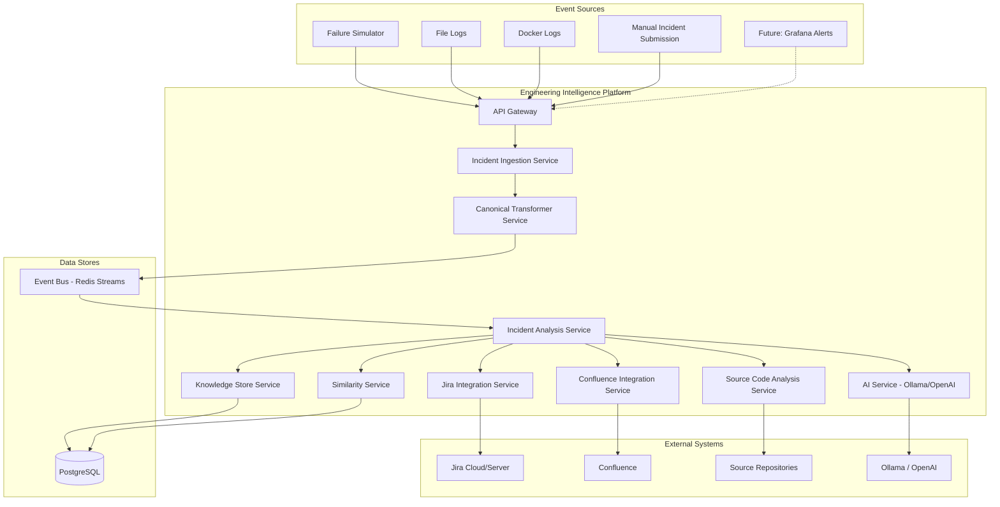
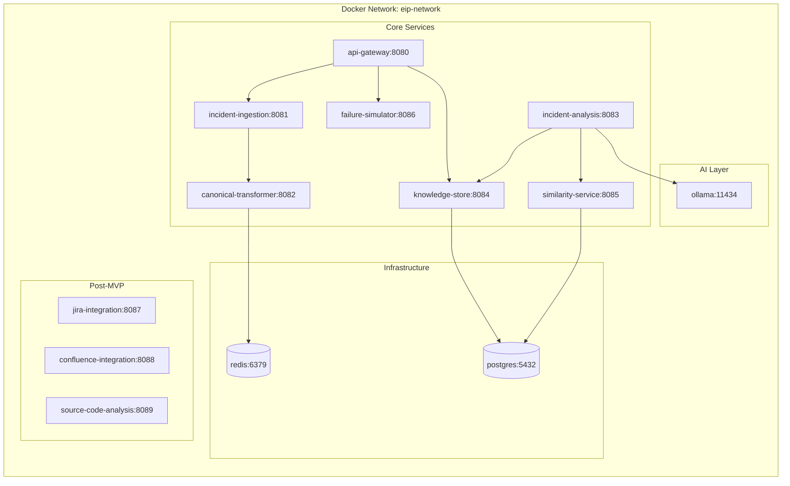
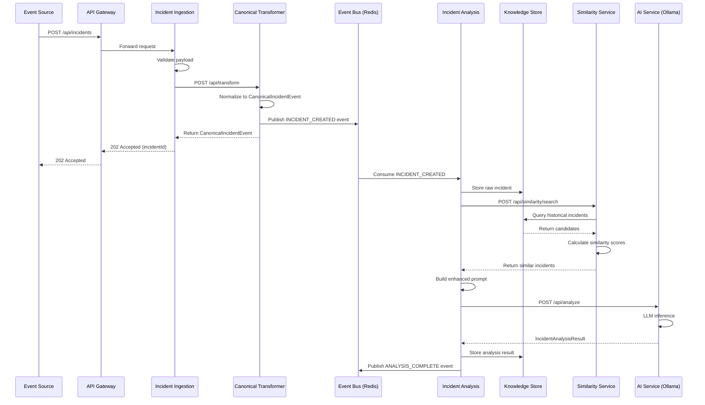
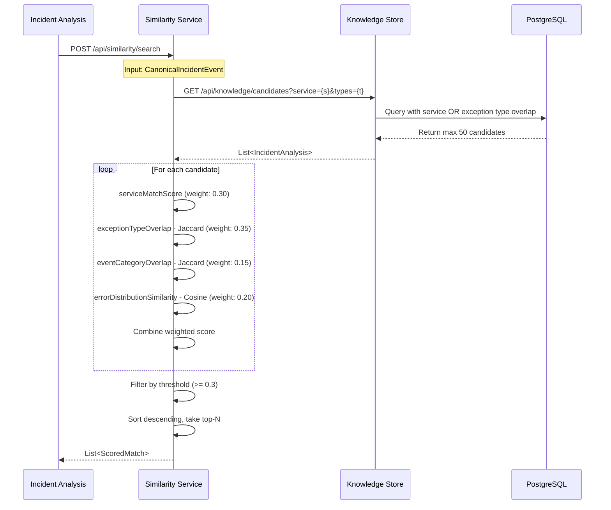
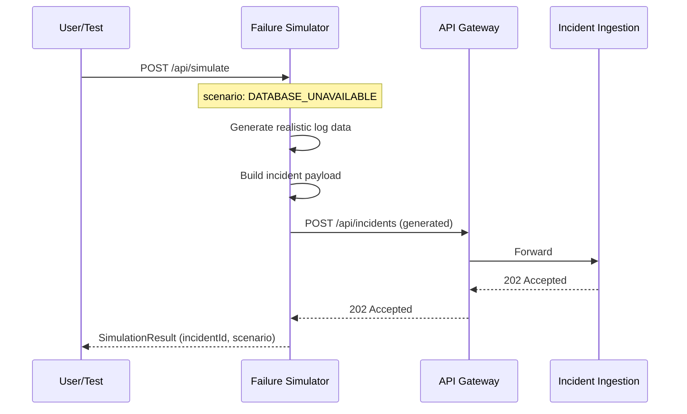

# Design Document: Engineering Intelligence Platform

## Overview

The Engineering Intelligence Platform evolves the existing AI Log Analyzer Spring Boot monolith into a microservice-based system capable of incident ingestion, classification, Root Cause Analysis (RCA) generation, similar incident detection, and integration with Jira, Confluence, and source code repositories. The platform accumulates engineering knowledge over time, enabling progressively better analysis through historical context correlation.

The architecture decomposes the current monolith's responsibilities (LogParserService, CanonicalEventTransformer, SimilarityMatchingService, IncidentAnalysisService, OllamaService, KnowledgeStoreRepository) into independently deployable services communicating via REST APIs and an event bus. Each service owns its domain, maintains health endpoints, and is deployed as a Docker container orchestrated through Docker Compose (with future Kubernetes migration path).

The MVP scope delivers: Incident Ingestion, Canonical Transformer, Knowledge Store, Incident Analysis, Similarity Service, Failure Simulator, and a unified REST API Gateway. Post-MVP adds Jira Integration, Confluence Integration, and Source Code Analysis services.

## Architecture

### System Context Diagram



### Deployment Architecture (Docker Compose)



## Sequence Diagrams

### Primary Flow: Incident Ingestion to RCA Generation



### Similarity Search Flow



### Failure Simulator Flow



## Components and Interfaces

### Component 1: API Gateway

**Purpose**: Single entry point for all external requests. Routes to appropriate microservices, handles cross-cutting concerns (CORS, rate limiting, request logging).

**Interface**:
```java
// Routes configuration (Spring Cloud Gateway or simple reverse proxy)
public interface ApiGatewayRoutes {
    // Incident operations
    // POST /api/incidents → incident-ingestion-service
    // GET  /api/incidents/{id} → knowledge-store-service
    // GET  /api/incidents → knowledge-store-service

    // Analysis operations
    // GET  /api/analyses/{id} → knowledge-store-service

    // Similarity operations
    // POST /api/similarity/search → similarity-service

    // Simulator operations
    // POST /api/simulate → failure-simulator-service
    // GET  /api/simulate/scenarios → failure-simulator-service

    // Health aggregation
    // GET  /api/health → aggregate all service health checks
}
```

**Responsibilities**:
- Request routing and load distribution
- API versioning (prefix: /api/v1/)
- Health check aggregation
- CORS and security headers
- Request/response logging

### Component 2: Incident Ingestion Service

**Purpose**: Receive incident events from any source, validate payloads, and forward to the Canonical Transformer for normalization.

**Interface**:
```java
@RestController
@RequestMapping("/api/incidents")
public interface IncidentIngestionApi {

    @PostMapping
    ResponseEntity<IngestionResponse> ingestIncident(
        @Valid @RequestBody IncidentSubmission submission);

    @PostMapping("/batch")
    ResponseEntity<BatchIngestionResponse> ingestBatch(
        @Valid @RequestBody List<IncidentSubmission> submissions);

    @GetMapping("/health")
    ResponseEntity<HealthStatus> health();
}

public record IncidentSubmission(
    @NotBlank String serviceName,
    @NotBlank String description,
    List<String> logSnippets,
    Map<String, String> metadata,
    String source,          // FILE_LOG, DOCKER_LOG, MANUAL, SIMULATOR, GRAFANA
    String severity         // Optional: caller-suggested severity
) {}

public record IngestionResponse(
    UUID incidentId,
    String status,          // ACCEPTED, REJECTED
    Instant acceptedAt,
    String message
) {}
```

**Responsibilities**:
- Payload validation (service name, description required)
- Source identification and tagging
- Deduplication check (optional, within time window)
- Forward to Canonical Transformer
- Return acceptance acknowledgment with incident ID

### Component 3: Canonical Transformer Service

**Purpose**: Convert heterogeneous incident formats into a unified CanonicalIncidentEvent model. Enables source-agnostic downstream processing.

**Interface**:
```java
@RestController
@RequestMapping("/api/transform")
public interface CanonicalTransformerApi {

    @PostMapping
    ResponseEntity<CanonicalIncidentEvent> transform(
        @Valid @RequestBody IncidentSubmission submission);

    @PostMapping("/batch")
    ResponseEntity<List<CanonicalIncidentEvent>> transformBatch(
        @Valid @RequestBody List<IncidentSubmission> submissions);

    @PostMapping("/logs")
    ResponseEntity<List<CanonicalEvent>> transformRawLogs(
        @RequestBody String rawLogContent);
}

public record CanonicalIncidentEvent(
    UUID incidentId,
    String serviceName,
    String severity,            // CRITICAL, HIGH, MEDIUM, LOW
    List<String> symptoms,
    Instant timestamp,
    String source,              // FILE_LOG, DOCKER_LOG, MANUAL, SIMULATOR
    Map<String, Object> rawPayload,
    List<CanonicalEvent> events,
    Map<String, Integer> exceptionCounts,
    Set<String> exceptionTypes,
    Map<String, Double> errorDistribution
) {}
```

**Responsibilities**:
- Parse raw log content using existing LogParserService patterns (multi-format timestamps, level detection, service extraction)
- Classify event types (EXCEPTION, ERROR, WARNING, STACK_TRACE, INFO)
- Generate exception counts and error distribution
- Assign severity based on exception frequency and types
- Publish INCIDENT_CREATED event to Event Bus

### Component 4: Incident Analysis Service

**Purpose**: Orchestrate the full analysis pipeline — enrich incident with historical context, generate RCA through AI, and persist results.

**Interface**:
```java
@RestController
@RequestMapping("/api/analysis")
public interface IncidentAnalysisApi {

    @PostMapping
    ResponseEntity<IncidentAnalysisResult> analyzeIncident(
        @Valid @RequestBody AnalysisRequest request);

    @GetMapping("/{incidentId}")
    ResponseEntity<IncidentAnalysisResult> getAnalysis(
        @PathVariable UUID incidentId);

    @PostMapping("/{incidentId}/reanalyze")
    ResponseEntity<IncidentAnalysisResult> reanalyze(
        @PathVariable UUID incidentId,
        @RequestBody ReanalyzeRequest request);
}

public record AnalysisRequest(
    CanonicalIncidentEvent incident,
    String modelOverride,       // Optional: specific LLM model
    boolean includeJiraContext,  // Post-MVP
    boolean includeConfluenceContext,  // Post-MVP
    boolean includeSourceAnalysis     // Post-MVP
) {}

public record IncidentAnalysisResult(
    UUID incidentId,
    UUID analysisId,
    String category,            // SERVICE_FAILURE, DATA_ERROR, NETWORK, RESOURCE, etc.
    String rootCause,
    String severity,
    double confidence,
    int confidencePercent,
    String summary,
    List<String> businessImpact,
    RecommendedActions recommendations,
    List<ScoredMatch> similarIncidents,
    List<Evidence> evidence,
    String status,              // COMPLETE, INCOMPLETE, FAILED
    Instant analyzedAt
) {}

public record RecommendedActions(
    List<String> immediate,
    List<String> shortTerm,
    List<String> longTerm
) {}

public record Evidence(
    String type,    // LOG_LINE, EXCEPTION, PATTERN, HISTORICAL
    String content,
    double relevance
) {}
```

**Responsibilities**:
- Consume INCIDENT_CREATED events from Event Bus
- Query Knowledge Store for historical context
- Query Similarity Service for related incidents
- Build enhanced LLM prompt with historical context (cap 8000 chars)
- Call AI Service for RCA generation
- Persist analysis results to Knowledge Store
- Publish ANALYSIS_COMPLETE event

### Component 5: Knowledge Store Service

**Purpose**: Persistent storage for incidents, analyses, resolutions, and cross-incident relationships. Single source of truth for all engineering knowledge.

**Interface**:
```java
@RestController
@RequestMapping("/api/knowledge")
public interface KnowledgeStoreApi {

    // Incidents
    @PostMapping("/incidents")
    ResponseEntity<IncidentRecord> storeIncident(
        @Valid @RequestBody CanonicalIncidentEvent incident);

    @GetMapping("/incidents/{id}")
    ResponseEntity<IncidentRecord> getIncident(@PathVariable UUID id);

    @GetMapping("/incidents")
    ResponseEntity<Page<IncidentRecord>> listIncidents(
        @RequestParam(defaultValue = "0") int page,
        @RequestParam(defaultValue = "20") int size,
        @RequestParam(required = false) String service,
        @RequestParam(required = false) String status);

    // Analyses
    @PostMapping("/analyses")
    ResponseEntity<AnalysisRecord> storeAnalysis(
        @Valid @RequestBody IncidentAnalysisResult analysis);

    @GetMapping("/analyses/{id}")
    ResponseEntity<AnalysisRecord> getAnalysis(@PathVariable UUID id);

    // Candidates for similarity
    @GetMapping("/candidates")
    ResponseEntity<List<IncidentRecord>> findCandidates(
        @RequestParam String service,
        @RequestParam List<String> exceptionTypes,
        @RequestParam UUID excludeId);

    // Resolutions
    @PostMapping("/resolutions")
    ResponseEntity<ResolutionRecord> storeResolution(
        @Valid @RequestBody ResolutionSubmission resolution);

    @GetMapping("/resolutions")
    ResponseEntity<List<ResolutionRecord>> findResolutions(
        @RequestParam String service,
        @RequestParam(required = false) String category);

    // Knowledge references (links to Jira, Confluence, etc.)
    @PostMapping("/references")
    ResponseEntity<KnowledgeReference> storeReference(
        @Valid @RequestBody KnowledgeReference reference);
}
```

**Responsibilities**:
- CRUD for incidents, analyses, resolutions
- Pre-filtered candidate retrieval for similarity matching
- Knowledge reference storage (Jira tickets, Confluence pages, code locations)
- Flyway-managed schema migrations
- Connection pooling via HikariCP

### Component 6: Similarity Service

**Purpose**: Find historically similar incidents using multi-factor weighted scoring.

**Interface**:
```java
@RestController
@RequestMapping("/api/similarity")
public interface SimilarityServiceApi {

    @PostMapping("/search")
    ResponseEntity<SimilaritySearchResult> searchSimilar(
        @Valid @RequestBody SimilaritySearchRequest request);

    @GetMapping("/score")
    ResponseEntity<SimilarityScoreResult> calculateScore(
        @RequestParam UUID incidentA,
        @RequestParam UUID incidentB);
}

public record SimilaritySearchRequest(
    UUID incidentId,
    String service,
    Set<String> exceptionTypes,
    Map<String, Integer> exceptionCounts,
    Map<String, Double> errorDistribution,
    int maxResults   // default: 5
) {}

public record SimilaritySearchResult(
    UUID queryIncidentId,
    List<ScoredMatch> matches,
    int candidatesEvaluated,
    Instant searchedAt
) {}

public record ScoredMatch(
    UUID incidentId,
    String service,
    Instant analysisDate,
    double similarityScore,
    String rootCause,
    Map<String, String> matchReasons
) {}
```

**Responsibilities**:
- Query Knowledge Store for candidates (pre-filtered by service OR exception type overlap)
- Calculate weighted similarity score per candidate
- Filter by minimum threshold (0.3)
- Return top-N matches sorted by score descending
- Phase 2: pgvector + embeddings for semantic similarity

### Component 7: AI Service (Ollama/OpenAI Adapter)

**Purpose**: Isolated AI inference layer supporting multiple LLM providers. Business services never call LLMs directly.

**Interface**:
```java
@RestController
@RequestMapping("/api/ai")
public interface AiServiceApi {

    @PostMapping("/analyze")
    ResponseEntity<AiAnalysisResponse> analyze(
        @Valid @RequestBody AiAnalysisRequest request);

    @GetMapping("/models")
    ResponseEntity<List<ModelInfo>> listAvailableModels();

    @GetMapping("/health")
    ResponseEntity<AiHealthStatus> health();
}

public record AiAnalysisRequest(
    String prompt,
    String model,           // e.g., "qwen3:1.7b", "qwen3:8b", "gpt-4"
    String provider,        // OLLAMA, OPENAI
    Map<String, Object> parameters  // temperature, max_tokens, etc.
) {}

public record AiAnalysisResponse(
    String severity,
    String confidence,
    int confidencePercent,
    String rootCause,
    List<String> businessImpact,
    RecommendedActions recommendedActions,
    String summary,
    String rawResponse,     // Fallback when structured parsing fails
    boolean structured,     // true if JSON parse succeeded
    String model,
    long inferenceTimeMs
) {}
```

**Responsibilities**:
- Adapter pattern for multiple LLM providers (Ollama, OpenAI, future)
- JSON output enforcement (format: "json" for Ollama)
- Timeout management (configurable per model)
- Fallback to raw text when JSON parsing fails
- Model availability health checking

### Component 8: Failure Simulator Service

**Purpose**: Generate realistic incidents for testing, AI evaluation, and demonstration without production dependencies.

**Interface**:
```java
@RestController
@RequestMapping("/api/simulate")
public interface FailureSimulatorApi {

    @PostMapping
    ResponseEntity<SimulationResult> simulate(
        @Valid @RequestBody SimulationRequest request);

    @GetMapping("/scenarios")
    ResponseEntity<List<ScenarioInfo>> listScenarios();

    @PostMapping("/batch")
    ResponseEntity<List<SimulationResult>> simulateBatch(
        @Valid @RequestBody BatchSimulationRequest request);
}

public record SimulationRequest(
    String scenario,        // DATABASE_UNAVAILABLE, SERVICE_TIMEOUT, etc.
    String targetService,   // Service name to simulate for
    int logLineCount,       // Number of log lines to generate (default: 50)
    Map<String, String> overrides  // Optional scenario parameter overrides
) {}

public record SimulationResult(
    UUID simulationId,
    UUID incidentId,
    String scenario,
    String targetService,
    int generatedLogLines,
    Instant simulatedAt,
    String status           // SUBMITTED, COMPLETED, FAILED
) {}

public enum SimulationScenario {
    DATABASE_UNAVAILABLE,
    SERVICE_TIMEOUT,
    CONNECTION_REFUSED,
    NULL_POINTER_EXCEPTION,
    LATENCY_SPIKE,
    MEMORY_EXHAUSTION,
    THREAD_DEADLOCK,
    AUTHENTICATION_FAILURE,
    DISK_FULL,
    NETWORK_PARTITION
}
```

**Responsibilities**:
- Maintain a library of realistic failure scenarios
- Generate time-series log data matching scenario patterns
- Submit generated incidents through the normal ingestion pipeline
- Support batch simulation for load testing
- Configurable scenario parameters

## Data Models

### Database Schema (PostgreSQL + Flyway)

```sql
-- V1: Core tables (extends existing schema)

-- Incidents table (source-agnostic)
CREATE TABLE incident (
    incident_id         UUID PRIMARY KEY DEFAULT uuid_generate_v4(),
    service_name        VARCHAR(255) NOT NULL,
    description         TEXT NOT NULL,
    severity            VARCHAR(20) NOT NULL DEFAULT 'MEDIUM',
    source              VARCHAR(50) NOT NULL DEFAULT 'MANUAL',
    status              VARCHAR(30) NOT NULL DEFAULT 'INGESTED',
    symptoms            JSONB DEFAULT '[]',
    metadata            JSONB DEFAULT '{}',
    raw_payload         JSONB,
    exception_counts    JSONB DEFAULT '{}',
    exception_types     TEXT[] DEFAULT '{}',
    error_distribution  JSONB DEFAULT '{}',
    total_events        INTEGER DEFAULT 0,
    total_exceptions    INTEGER DEFAULT 0,
    created_at          TIMESTAMP WITH TIME ZONE NOT NULL DEFAULT NOW(),
    updated_at          TIMESTAMP WITH TIME ZONE NOT NULL DEFAULT NOW()
);

-- Incident analysis results
CREATE TABLE incident_analysis (
    analysis_id         UUID PRIMARY KEY DEFAULT uuid_generate_v4(),
    incident_id         UUID NOT NULL REFERENCES incident(incident_id),
    category            VARCHAR(50),
    root_cause          TEXT,
    severity            VARCHAR(20),
    confidence          VARCHAR(20),
    confidence_percent  INTEGER DEFAULT 0,
    summary             TEXT,
    business_impact     JSONB DEFAULT '[]',
    recommendations     JSONB DEFAULT '{}',
    evidence            JSONB DEFAULT '[]',
    llm_model           VARCHAR(100),
    llm_provider        VARCHAR(50),
    inference_time_ms   BIGINT,
    raw_response        TEXT,
    status              VARCHAR(20) NOT NULL DEFAULT 'COMPLETE',
    error_message       TEXT,
    analyzed_at         TIMESTAMP WITH TIME ZONE NOT NULL DEFAULT NOW()
);

-- Incident resolutions (human-verified fixes)
CREATE TABLE incident_resolution (
    resolution_id       UUID PRIMARY KEY DEFAULT uuid_generate_v4(),
    incident_id         UUID NOT NULL REFERENCES incident(incident_id),
    analysis_id         UUID REFERENCES incident_analysis(analysis_id),
    resolved_by         VARCHAR(255),
    resolution_summary  TEXT NOT NULL,
    resolution_steps    JSONB DEFAULT '[]',
    verification_notes  TEXT,
    time_to_resolve_ms  BIGINT,
    resolved_at         TIMESTAMP WITH TIME ZONE NOT NULL DEFAULT NOW()
);

-- Similarity relationships between incidents
CREATE TABLE incident_similarity (
    id                  UUID PRIMARY KEY DEFAULT uuid_generate_v4(),
    incident_a_id       UUID NOT NULL REFERENCES incident(incident_id),
    incident_b_id       UUID NOT NULL REFERENCES incident(incident_id),
    similarity_score    DOUBLE PRECISION NOT NULL,
    match_reasons       JSONB DEFAULT '{}',
    computed_at         TIMESTAMP WITH TIME ZONE NOT NULL DEFAULT NOW(),
    UNIQUE (incident_a_id, incident_b_id)
);

-- Knowledge references (links to external systems)
CREATE TABLE knowledge_reference (
    reference_id        UUID PRIMARY KEY DEFAULT uuid_generate_v4(),
    incident_id         UUID REFERENCES incident(incident_id),
    analysis_id         UUID REFERENCES incident_analysis(analysis_id),
    reference_type      VARCHAR(50) NOT NULL,  -- JIRA, CONFLUENCE, SOURCE_CODE
    external_id         VARCHAR(500),
    external_url        TEXT,
    title               VARCHAR(500),
    content_snippet     TEXT,
    relevance_score     DOUBLE PRECISION,
    created_at          TIMESTAMP WITH TIME ZONE NOT NULL DEFAULT NOW()
);

-- Canonical events (normalized log lines)
CREATE TABLE canonical_event (
    event_id            UUID PRIMARY KEY DEFAULT uuid_generate_v4(),
    incident_id         UUID NOT NULL REFERENCES incident(incident_id) ON DELETE CASCADE,
    timestamp           TIMESTAMP WITH TIME ZONE,
    level               VARCHAR(10) NOT NULL,
    service             VARCHAR(255),
    event_type          VARCHAR(50) NOT NULL,
    message             TEXT,
    created_at          TIMESTAMP WITH TIME ZONE NOT NULL DEFAULT NOW()
);

-- Indexes
CREATE INDEX idx_incident_service ON incident(service_name);
CREATE INDEX idx_incident_status ON incident(status);
CREATE INDEX idx_incident_created ON incident(created_at DESC);
CREATE INDEX idx_incident_types ON incident USING GIN(exception_types);
CREATE INDEX idx_analysis_incident ON incident_analysis(incident_id);
CREATE INDEX idx_analysis_category ON incident_analysis(category);
CREATE INDEX idx_resolution_incident ON incident_resolution(incident_id);
CREATE INDEX idx_similarity_a ON incident_similarity(incident_a_id);
CREATE INDEX idx_similarity_b ON incident_similarity(incident_b_id);
CREATE INDEX idx_reference_incident ON knowledge_reference(incident_id);
CREATE INDEX idx_reference_type ON knowledge_reference(reference_type);
CREATE INDEX idx_event_incident ON canonical_event(incident_id);
CREATE INDEX idx_event_type ON canonical_event(event_type);
CREATE INDEX idx_event_level ON canonical_event(level);

-- Constraints
ALTER TABLE incident ADD CONSTRAINT chk_incident_severity
    CHECK (severity IN ('CRITICAL', 'HIGH', 'MEDIUM', 'LOW'));
ALTER TABLE incident ADD CONSTRAINT chk_incident_source
    CHECK (source IN ('FILE_LOG', 'DOCKER_LOG', 'MANUAL', 'SIMULATOR', 'GRAFANA', 'API'));
ALTER TABLE incident ADD CONSTRAINT chk_incident_status
    CHECK (status IN ('INGESTED', 'TRANSFORMING', 'ANALYZING', 'COMPLETE', 'FAILED'));
ALTER TABLE canonical_event ADD CONSTRAINT chk_ce_level
    CHECK (level IN ('ERROR', 'WARN', 'INFO', 'DEBUG', 'TRACE'));
ALTER TABLE canonical_event ADD CONSTRAINT chk_ce_event_type
    CHECK (event_type IN ('EXCEPTION', 'ERROR', 'WARNING', 'STACK_TRACE', 'INFO'));
ALTER TABLE incident_analysis ADD CONSTRAINT chk_ia_status
    CHECK (status IN ('COMPLETE', 'INCOMPLETE', 'FAILED'));
```

### Core Domain Models (Java Records)

```java
// Shared across services via a common library (eip-common)

public record CanonicalIncidentEvent(
    UUID incidentId,
    String serviceName,
    String severity,
    List<String> symptoms,
    Instant timestamp,
    String source,
    Map<String, Object> rawPayload,
    List<CanonicalEvent> events,
    Map<String, Integer> exceptionCounts,
    Set<String> exceptionTypes,
    Map<String, Double> errorDistribution,
    int totalEvents,
    int totalExceptions
) {}

public record CanonicalEvent(
    UUID eventId,
    UUID incidentId,
    Instant timestamp,
    String level,       // ERROR, WARN, INFO, DEBUG, TRACE
    String service,
    String eventType,   // EXCEPTION, ERROR, WARNING, STACK_TRACE, INFO
    String message
) {}

public record IncidentAnalysisResult(
    UUID analysisId,
    UUID incidentId,
    String category,
    String rootCause,
    String severity,
    double confidence,
    int confidencePercent,
    String summary,
    List<String> businessImpact,
    RecommendedActions recommendations,
    List<ScoredMatch> similarIncidents,
    List<Evidence> evidence,
    String llmModel,
    String llmProvider,
    long inferenceTimeMs,
    String status,
    Instant analyzedAt
) {}

public record ScoredMatch(
    UUID incidentId,
    String service,
    Instant analysisDate,
    double similarityScore,
    String rootCause,
    Map<String, String> matchReasons
) {}
```

## Key Functions with Formal Specifications

### Function 1: ingestIncident()

```java
public IngestionResponse ingestIncident(IncidentSubmission submission)
```

**Preconditions:**
- `submission` is non-null
- `submission.serviceName()` is non-blank, length ≤ 255
- `submission.description()` is non-blank, length ≤ 10000
- `submission.source()` is one of: FILE_LOG, DOCKER_LOG, MANUAL, SIMULATOR, GRAFANA, API (or null → defaults to MANUAL)

**Postconditions:**
- Returns `IngestionResponse` with status ACCEPTED and a valid UUID incidentId
- If validation fails: returns status REJECTED with error message
- A CanonicalIncidentEvent is created and forwarded to the transformer
- No incident is stored directly — storage happens after transformation

**Loop Invariants:** N/A

### Function 2: transformToCanonical()

```java
public CanonicalIncidentEvent transformToCanonical(IncidentSubmission submission)
```

**Preconditions:**
- `submission` is a valid IncidentSubmission (passed ingestion validation)
- At least one of: `description` contains parseable log content, OR `logSnippets` is non-empty

**Postconditions:**
- Returns a `CanonicalIncidentEvent` with:
  - `incidentId` is a new valid UUID
  - `serviceName` equals `submission.serviceName()`
  - `severity` is one of CRITICAL, HIGH, MEDIUM, LOW (derived from exception analysis)
  - `exceptionCounts` map has entries for each detected exception type
  - `errorDistribution` percentages sum to exactly 100.0 (or empty if no exceptions)
  - `events` list preserves input ordering of log lines
- Event INCIDENT_CREATED is published to the Event Bus

**Loop Invariants:**
- While processing log lines: all previously processed lines have valid CanonicalEvent representations

### Function 3: calculateSimilarityScore()

```java
public double calculateSimilarityScore(IncidentRecord candidate, IncidentRecord current)
```

**Preconditions:**
- `candidate` and `current` are non-null
- Both have valid `incidentId` (non-null UUIDs)
- `candidate.incidentId` ≠ `current.incidentId`

**Postconditions:**
- Returns a value in [0.0, 1.0]
- Score = 0.30 × serviceMatch + 0.35 × exceptionTypeJaccard + 0.15 × eventCategoryJaccard + 0.20 × errorDistributionCosine
- `serviceMatch` = 1.0 if services equal (case-insensitive), 0.0 otherwise
- `exceptionTypeJaccard` = |intersection(types1, types2)| / |union(types1, types2)|; 1.0 if both empty; 0.0 if one empty
- `eventCategoryJaccard` = Jaccard on exception count key sets
- `errorDistributionCosine` = cosine similarity on error distribution vectors; 1.0 if both empty
- Result is clamped to [0.0, 1.0]

**Loop Invariants:**
- During candidate evaluation: accumulated score ≥ 0.0 at each step

### Function 4: analyzeIncident()

```java
public IncidentAnalysisResult analyzeIncident(AnalysisRequest request)
```

**Preconditions:**
- `request.incident()` is a valid CanonicalIncidentEvent
- `request.incident().incidentId()` is non-null
- AI service is reachable (health check passes) OR graceful degradation applies

**Postconditions:**
- Returns `IncidentAnalysisResult` with status COMPLETE if AI response parses successfully
- Returns status INCOMPLETE if AI returns non-parseable response (rawResponse populated)
- Returns status FAILED if AI service unreachable after retry
- `similarIncidents` contains 0 to maxResults entries, all with score ≥ 0.3
- Result is persisted to Knowledge Store before return
- Event ANALYSIS_COMPLETE is published to Event Bus

**Loop Invariants:**
- Retry loop: attempt counter ≤ maxRetries; delay doubles each iteration

### Function 5: generateSimulatedIncident()

```java
public SimulationResult generateSimulatedIncident(SimulationRequest request)
```

**Preconditions:**
- `request.scenario()` is a valid SimulationScenario enum value
- `request.targetService()` is non-blank
- `request.logLineCount()` > 0 (defaults to 50 if not specified)

**Postconditions:**
- Returns `SimulationResult` with a valid `simulationId` and `incidentId`
- Generated log content matches the scenario's expected patterns:
  - DATABASE_UNAVAILABLE → contains ConnectionException, PSQLException
  - SERVICE_TIMEOUT → contains TimeoutException, SocketTimeoutException
  - NULL_POINTER_EXCEPTION → contains NullPointerException with stack trace
- The generated incident is submitted through the normal ingestion pipeline
- `generatedLogLines` equals the actual count of non-empty lines generated

**Loop Invariants:**
- During log generation: line counter ≤ `logLineCount`; each generated line has valid timestamp and structure

## Algorithmic Pseudocode

### Main Analysis Pipeline Algorithm

```java
/**
 * ALGORITHM: Full Incident Analysis Pipeline
 *
 * INPUT: CanonicalIncidentEvent incident
 * OUTPUT: IncidentAnalysisResult
 *
 * PRECONDITION: incident is valid, AI service available
 * POSTCONDITION: result persisted, ANALYSIS_COMPLETE published
 */
public IncidentAnalysisResult executeAnalysisPipeline(CanonicalIncidentEvent incident) {
    // Step 1: Persist raw incident to Knowledge Store
    knowledgeStoreClient.storeIncident(incident);

    // Step 2: Find similar historical incidents
    List<ScoredMatch> similarIncidents = similarityClient.searchSimilar(
        new SimilaritySearchRequest(
            incident.incidentId(),
            incident.serviceName(),
            incident.exceptionTypes(),
            incident.exceptionCounts(),
            incident.errorDistribution(),
            MAX_SIMILAR_RESULTS  // 5
        )
    );

    // Step 3: Build enhanced prompt with historical context
    String basePrompt = buildBasePrompt(incident);
    String enhancedPrompt = appendHistoricalContext(basePrompt, similarIncidents);
    // INVARIANT: enhancedPrompt.length() <= basePrompt.length() + MAX_HISTORY_CHARS (8000)

    // Step 4: Call AI service with retry
    AiAnalysisResponse aiResponse = callAiWithRetry(enhancedPrompt, incident);

    // Step 5: Compose analysis result
    IncidentAnalysisResult result = composeResult(incident, aiResponse, similarIncidents);

    // Step 6: Persist analysis
    knowledgeStoreClient.storeAnalysis(result);

    // Step 7: Publish completion event
    eventBus.publish("ANALYSIS_COMPLETE", result);

    return result;
}

/**
 * AI call with exponential backoff retry.
 * Retries: 1s, 2s, 4s delays. Max 3 attempts.
 */
private AiAnalysisResponse callAiWithRetry(String prompt, CanonicalIncidentEvent incident) {
    int maxRetries = 3;
    long delayMs = 1000;

    for (int attempt = 1; attempt <= maxRetries; attempt++) {
        try {
            return aiServiceClient.analyze(new AiAnalysisRequest(
                prompt,
                resolveModel(),
                resolveProvider(),
                Map.of("temperature", 0.3, "max_tokens", 4096)
            ));
        } catch (Exception e) {
            if (attempt == maxRetries) {
                return AiAnalysisResponse.failed("AI service unavailable after " + maxRetries + " retries");
            }
            sleep(delayMs);
            delayMs *= 2;
        }
    }
    // Unreachable due to loop structure
    throw new IllegalStateException("Retry loop exited without result");
}
```

### Similarity Search Algorithm

```java
/**
 * ALGORITHM: Multi-Factor Weighted Similarity Search
 *
 * INPUT: SimilaritySearchRequest request
 * OUTPUT: SimilaritySearchResult with ranked matches
 *
 * PRECONDITION: request has valid service and/or exceptionTypes
 * POSTCONDITION: all returned matches have score >= MINIMUM_THRESHOLD (0.3)
 *                results sorted by score descending
 *                results.size() <= request.maxResults()
 */
public SimilaritySearchResult searchSimilar(SimilaritySearchRequest request) {
    // Phase 1: Retrieve candidates (pre-filtered by DB query)
    List<IncidentRecord> candidates = knowledgeStoreClient.findCandidates(
        request.service(),
        request.exceptionTypes(),
        request.incidentId()  // exclude self
    );
    // INVARIANT: candidates.size() <= 50 (DB limit)

    // Phase 2: Score each candidate
    List<ScoredMatch> scored = new ArrayList<>();
    for (IncidentRecord candidate : candidates) {
        // LOOP INVARIANT: all elements in scored have score >= MINIMUM_THRESHOLD
        double score = calculateWeightedScore(candidate, request);

        if (score >= MINIMUM_THRESHOLD) {
            Map<String, String> reasons = buildMatchReasons(candidate, request);
            scored.add(new ScoredMatch(
                candidate.incidentId(),
                candidate.serviceName(),
                candidate.createdAt(),
                score,
                candidate.rootCause(),
                reasons
            ));
        }
    }

    // Phase 3: Rank and truncate
    scored.sort(Comparator.comparingDouble(ScoredMatch::similarityScore).reversed());
    List<ScoredMatch> topMatches = scored.stream()
        .limit(request.maxResults())
        .toList();

    return new SimilaritySearchResult(
        request.incidentId(),
        topMatches,
        candidates.size(),
        Instant.now()
    );
}

/**
 * Weighted similarity calculation.
 * Returns value in [0.0, 1.0].
 */
private double calculateWeightedScore(IncidentRecord candidate, SimilaritySearchRequest request) {
    double serviceScore = candidate.serviceName().equalsIgnoreCase(request.service()) ? 1.0 : 0.0;
    double exceptionJaccard = jaccardIndex(candidate.exceptionTypes(), request.exceptionTypes());
    double categoryJaccard = jaccardIndex(
        candidate.exceptionCounts().keySet(),
        request.exceptionCounts().keySet()
    );
    double distributionCosine = cosineSimilarity(
        candidate.errorDistribution(),
        request.errorDistribution()
    );

    double score = SERVICE_WEIGHT * serviceScore           // 0.30
                 + EXCEPTION_TYPE_WEIGHT * exceptionJaccard // 0.35
                 + EVENT_CATEGORY_WEIGHT * categoryJaccard  // 0.15
                 + ERROR_DISTRIBUTION_WEIGHT * distributionCosine; // 0.20

    return Math.min(1.0, Math.max(0.0, score));
}

/**
 * Jaccard Index: |A ∩ B| / |A ∪ B|
 * Returns 1.0 if both sets empty, 0.0 if one empty and other not.
 */
private double jaccardIndex(Set<String> setA, Set<String> setB) {
    Set<String> a = setA != null ? setA : Set.of();
    Set<String> b = setB != null ? setB : Set.of();

    if (a.isEmpty() && b.isEmpty()) return 1.0;
    if (a.isEmpty() || b.isEmpty()) return 0.0;

    Set<String> intersection = new HashSet<>(a);
    intersection.retainAll(b);

    Set<String> union = new HashSet<>(a);
    union.addAll(b);

    return (double) intersection.size() / union.size();
}

/**
 * Cosine Similarity over error distribution vectors.
 * Returns 1.0 if both maps empty, 0.0 if one empty.
 */
private double cosineSimilarity(Map<String, Double> vecA, Map<String, Double> vecB) {
    Map<String, Double> a = vecA != null ? vecA : Map.of();
    Map<String, Double> b = vecB != null ? vecB : Map.of();

    if (a.isEmpty() && b.isEmpty()) return 1.0;
    if (a.isEmpty() || b.isEmpty()) return 0.0;

    Set<String> allKeys = new HashSet<>();
    allKeys.addAll(a.keySet());
    allKeys.addAll(b.keySet());

    double dotProduct = 0.0, normA = 0.0, normB = 0.0;
    for (String key : allKeys) {
        double va = a.getOrDefault(key, 0.0);
        double vb = b.getOrDefault(key, 0.0);
        dotProduct += va * vb;
        normA += va * va;
        normB += vb * vb;
    }

    if (normA == 0.0 || normB == 0.0) return 0.0;
    return dotProduct / (Math.sqrt(normA) * Math.sqrt(normB));
}
```

### Canonical Event Transformation Algorithm

```java
/**
 * ALGORITHM: Transform raw incident submission to canonical model
 *
 * INPUT: IncidentSubmission with serviceName, description, logSnippets
 * OUTPUT: CanonicalIncidentEvent with normalized events
 *
 * PRECONDITION: submission passed validation
 * POSTCONDITION: all events have valid level, eventType, and message
 *                exceptionCounts reflects actual exception occurrences
 *                errorDistribution percentages sum to 100.0 (or empty)
 */
public CanonicalIncidentEvent transformToCanonical(IncidentSubmission submission) {
    UUID incidentId = UUID.randomUUID();

    // Combine all log content
    StringBuilder allLogs = new StringBuilder(submission.description());
    if (submission.logSnippets() != null) {
        for (String snippet : submission.logSnippets()) {
            allLogs.append("\n").append(snippet);
        }
    }
    String rawContent = allLogs.toString();

    // Transform each line to canonical event
    List<CanonicalEvent> events = new ArrayList<>();
    Map<String, Integer> exceptionCounts = new LinkedHashMap<>();
    String[] lines = rawContent.split("\\r?\\n");

    for (String line : lines) {
        if (line.isBlank()) continue;

        CanonicalEvent event = new CanonicalEvent(
            UUID.randomUUID(),
            incidentId,
            extractTimestamp(line),      // Falls back to Instant.now()
            detectLevel(line),           // Defaults to INFO
            detectService(line),         // Defaults to UNKNOWN
            classifyEventType(line),     // EXCEPTION, ERROR, WARNING, STACK_TRACE, INFO
            truncateMessage(line, 4000)
        );
        events.add(event);

        // Count exceptions
        if ("EXCEPTION".equals(event.eventType())) {
            String exType = extractExceptionClass(line);
            exceptionCounts.merge(exType, 1, Integer::sum);
        }
    }

    // Calculate error distribution
    int totalExceptions = exceptionCounts.values().stream().mapToInt(Integer::intValue).sum();
    Map<String, Double> errorDistribution = calculateDistribution(exceptionCounts, totalExceptions);

    // Determine severity
    String severity = deriveSeverity(exceptionCounts, totalExceptions, events.size());

    // Extract symptoms
    List<String> symptoms = extractSymptoms(events, exceptionCounts);

    return new CanonicalIncidentEvent(
        incidentId,
        submission.serviceName(),
        severity,
        symptoms,
        Instant.now(),
        submission.source() != null ? submission.source() : "MANUAL",
        Map.of("description", submission.description()),
        events,
        exceptionCounts,
        exceptionCounts.keySet(),
        errorDistribution,
        events.size(),
        totalExceptions
    );
}

/**
 * Derive severity from exception patterns.
 * CRITICAL: > 100 exceptions OR contains OutOfMemoryError/StackOverflowError
 * HIGH: > 50 exceptions OR > 5 unique exception types
 * MEDIUM: > 10 exceptions
 * LOW: otherwise
 */
private String deriveSeverity(Map<String, Integer> exceptionCounts, int totalExceptions, int totalEvents) {
    Set<String> criticalExceptions = Set.of("OutOfMemoryError", "StackOverflowError", "ThreadDeath");
    boolean hasCritical = exceptionCounts.keySet().stream()
        .anyMatch(criticalExceptions::contains);

    if (hasCritical || totalExceptions > 100) return "CRITICAL";
    if (totalExceptions > 50 || exceptionCounts.size() > 5) return "HIGH";
    if (totalExceptions > 10) return "MEDIUM";
    return "LOW";
}
```

## Example Usage

```java
// Example 1: Submit incident via API
HttpClient client = HttpClient.newHttpClient();

String payload = """
    {
      "serviceName": "payment-service",
      "description": "Multiple timeout errors observed in payment processing",
      "logSnippets": [
        "2024-01-15T10:30:45.123 ERROR [payment-service] SocketTimeoutException: Connection timed out",
        "2024-01-15T10:30:46.456 ERROR [payment-service] PaymentProcessingException: Failed to process payment",
        "    at com.payment.PaymentController.processPayment(PaymentController.java:45)"
      ],
      "metadata": {"environment": "production", "region": "us-east-1"},
      "source": "MANUAL"
    }
    """;

HttpResponse<String> response = client.send(
    HttpRequest.newBuilder()
        .uri(URI.create("http://localhost:8080/api/v1/incidents"))
        .header("Content-Type", "application/json")
        .POST(HttpRequest.BodyPublishers.ofString(payload))
        .build(),
    HttpResponse.BodyHandlers.ofString()
);
// Returns: {"incidentId": "...", "status": "ACCEPTED", ...}

// Example 2: Run failure simulation
String simPayload = """
    {
      "scenario": "DATABASE_UNAVAILABLE",
      "targetService": "order-service",
      "logLineCount": 100
    }
    """;

HttpResponse<String> simResponse = client.send(
    HttpRequest.newBuilder()
        .uri(URI.create("http://localhost:8080/api/v1/simulate"))
        .header("Content-Type", "application/json")
        .POST(HttpRequest.BodyPublishers.ofString(simPayload))
        .build(),
    HttpResponse.BodyHandlers.ofString()
);
// Returns: {"simulationId": "...", "incidentId": "...", "scenario": "DATABASE_UNAVAILABLE", ...}

// Example 3: Query similar incidents
String similarPayload = """
    {
      "incidentId": "550e8400-e29b-41d4-a716-446655440000",
      "service": "payment-service",
      "exceptionTypes": ["SocketTimeoutException", "PaymentProcessingException"],
      "exceptionCounts": {"SocketTimeoutException": 15, "PaymentProcessingException": 8},
      "errorDistribution": {"SocketTimeoutException": 65.2, "PaymentProcessingException": 34.8},
      "maxResults": 5
    }
    """;

HttpResponse<String> simResult = client.send(
    HttpRequest.newBuilder()
        .uri(URI.create("http://localhost:8080/api/v1/similarity/search"))
        .header("Content-Type", "application/json")
        .POST(HttpRequest.BodyPublishers.ofString(similarPayload))
        .build(),
    HttpResponse.BodyHandlers.ofString()
);
// Returns: {"queryIncidentId": "...", "matches": [...], "candidatesEvaluated": 23, ...}
```

## Correctness Properties

The following properties must hold across the system:

### Property 1: Ingestion Completeness
∀ incident i submitted via POST /api/incidents with valid payload:
  - i receives a unique UUID (incidentId)
  - i is transformed into a CanonicalIncidentEvent
  - i appears in the Knowledge Store within bounded time

**Validates: Requirements 1.1, 2.1, 4.2**

### Property 2: Transformation Idempotency
∀ IncidentSubmission s:
  transformToCanonical(s).exceptionCounts == transformToCanonical(s).exceptionCounts
  (Same input produces same exception counts and distribution)

**Validates: Requirements 2.5, 12.8, 12.9**

### Property 3: Similarity Score Bounds
∀ IncidentRecord a, b where a.id ≠ b.id:
  0.0 ≤ calculateSimilarityScore(a, b) ≤ 1.0

**Validates: Requirements 5.2, 12.7**

### Property 4: Similarity Score Symmetry
∀ IncidentRecord a, b:
  calculateSimilarityScore(a, b) == calculateSimilarityScore(b, a)

**Validates: Requirements 5.3**

### Property 5: Similarity Threshold Filtering
∀ ScoredMatch m in searchSimilar(request).matches:
  m.similarityScore >= MINIMUM_THRESHOLD (0.3)

**Validates: Requirements 5.7**

### Property 6: Error Distribution Consistency
∀ CanonicalIncidentEvent e where e.exceptionCounts is non-empty:
  sum(e.errorDistribution.values()) == 100.0
  ∧ e.errorDistribution.keySet() == e.exceptionCounts.keySet()

**Validates: Requirements 2.5, 12.8, 12.9**

### Property 7: Analysis Pipeline Ordering
∀ incident analysis:
  INGESTED → TRANSFORMING → ANALYZING → COMPLETE|FAILED
  (Status transitions are monotonically forward; no backward transitions)

**Validates: Requirements 3.1, 12.6**

### Property 8: Knowledge Accumulation
∀ IncidentAnalysisResult r with status COMPLETE:
  r is persisted to Knowledge Store before ANALYSIS_COMPLETE event is published
  ∧ r is available for future similarity searches

**Validates: Requirements 3.8, 10.3**

### Property 9: Canonical Event Validity
∀ CanonicalEvent ce:
  ce.level ∈ {ERROR, WARN, INFO, DEBUG, TRACE}
  ∧ ce.eventType ∈ {EXCEPTION, ERROR, WARNING, STACK_TRACE, INFO}
  ∧ ce.message.length() ≤ 4000

**Validates: Requirements 2.3, 2.4, 2.9, 12.1, 12.2, 12.3**

### Property 10: Self-Exclusion in Similarity
∀ similarity search for incident i:
  i ∉ searchSimilar(request_for_i).matches
  (An incident is never returned as similar to itself)

**Validates: Requirements 5.4**

## Error Handling

### Error Scenario 1: AI Service Unavailable

**Condition**: Ollama/OpenAI endpoint unreachable or returns 5xx
**Response**: Retry with exponential backoff (1s, 2s, 4s). After 3 attempts, mark analysis as INCOMPLETE with error message.
**Recovery**: Store incident and partial analysis. Re-analyze endpoint available for manual retry once AI service recovers.

### Error Scenario 2: Invalid Incident Payload

**Condition**: Missing required fields (serviceName, description) or constraint violations
**Response**: Return 400 Bad Request with validation error details. No incident created.
**Recovery**: Client corrects payload and resubmits.

### Error Scenario 3: Database Unavailable

**Condition**: PostgreSQL connection pool exhausted or service unreachable
**Response**: Return 503 Service Unavailable. HikariCP handles connection retry internally.
**Recovery**: Health check endpoint reflects degraded state. Requests queue until connections available (bounded by pool size).

### Error Scenario 4: Event Bus Failure (Redis Down)

**Condition**: Redis Streams unavailable for event publishing
**Response**: Fall back to synchronous processing. Log warning. Analysis still completes but without event-driven notifications.
**Recovery**: Once Redis recovers, pending events are not replayed (at-most-once semantics for MVP). Future: dead letter queue.

### Error Scenario 5: LLM Response Parsing Failure

**Condition**: AI returns non-JSON or malformed JSON despite format enforcement
**Response**: Store raw response text. Mark analysis INCOMPLETE. Set `structured = false`.
**Recovery**: User can view raw AI output. Reanalyze endpoint allows retry with different model.

### Error Scenario 6: Similarity Service Timeout

**Condition**: Similarity search exceeds configured timeout (default: 5s)
**Response**: Continue analysis without historical context. Log warning. Include empty `similarIncidents` list in result.
**Recovery**: Analysis completes with reduced quality. Similarity data available for future queries.

## Testing Strategy

### Unit Testing Approach

- Test each service's core logic in isolation using JUnit 5 + Mockito
- Key test cases:
  - CanonicalTransformer: multi-format timestamp parsing, level detection, event type classification
  - SimilarityService: Jaccard index, cosine similarity, weighted score calculation, threshold filtering
  - AI adapter: response parsing, fallback handling, timeout behavior
- Target: >80% line coverage for core domain logic

### Property-Based Testing Approach

**Property Test Library**: jqwik (Java property-based testing)

- Similarity score always in [0.0, 1.0] for arbitrary inputs
- Similarity score is symmetric (a,b) == (b,a)
- Error distribution always sums to 100.0 for non-empty exception counts
- Canonical event transformation is deterministic for same input
- Jaccard index satisfies: 0.0 ≤ J(A,B) ≤ 1.0 for all sets A, B

### Integration Testing Approach

- Testcontainers for PostgreSQL and Redis integration tests
- Full pipeline integration test: submit incident → verify analysis appears in Knowledge Store
- Docker Compose test profile for end-to-end flows
- Health check verification for all services
- Contract testing between services using Spring Cloud Contract or Pact

## Performance Considerations

- **Connection Pooling**: HikariCP with max 10 connections per service (configurable)
- **Candidate Limiting**: Similarity search pre-filters to max 50 candidates via DB query before in-memory scoring
- **Historical Context Cap**: Enhanced LLM prompt capped at 8000 chars for historical context to manage token usage
- **Batch Event Persistence**: Canonical events stored in batches of 1000 via JDBC batch updates
- **Async Analysis**: Incident ingestion returns 202 immediately; analysis runs asynchronously via Event Bus
- **LLM Timeout**: Configurable per model (default 300s for local Ollama, 60s for OpenAI)
- **Database Indexing**: GIN index on exception_types array for efficient overlap queries

## Security Considerations

- **Internal Network**: All inter-service communication over Docker network (not exposed externally)
- **API Gateway**: Single external entry point; future addition of API keys or JWT auth
- **No Secrets in Logs**: AI prompts and responses sanitized before logging
- **Database Credentials**: Externalized via environment variables (Docker secrets in production)
- **LLM Data**: Sensitive log content stays within internal network when using Ollama; OpenAI usage requires explicit opt-in
- **Input Validation**: Jakarta Bean Validation on all API boundaries; message truncation at 4000 bytes

## Dependencies

### Core (All Services)
- Spring Boot 3.3.x (Java 17)
- Spring Web (REST APIs)
- Spring Data JPA (Knowledge Store)
- Spring Validation (Bean validation)
- PostgreSQL 15+ (data store)
- Flyway (schema migrations)
- HikariCP (connection pooling)
- Jackson (JSON serialization)

### Infrastructure
- Redis 7+ (Event Bus via Redis Streams)
- Docker + Docker Compose (deployment)

### AI Layer
- Spring WebFlux/WebClient (non-blocking HTTP for LLM calls)
- Ollama (local LLM inference)
- Future: OpenAI Java SDK

### Testing
- JUnit 5
- Mockito
- jqwik (property-based testing)
- Testcontainers (PostgreSQL, Redis)
- Spring Cloud Contract / Pact (contract testing)

### Build
- Maven (multi-module project)
- Internal Artifactory: http://10.2.39.7:8080/artifactory/maven_ctos

### Shared Library: eip-common
- Contains: CanonicalIncidentEvent, CanonicalEvent, ScoredMatch, all shared DTOs
- Published to internal Artifactory
- Versioned independently from services

## Docker Compose Configuration

```yaml
# docker-compose.yml (MVP)
version: '3.8'

services:
  postgres:
    image: postgres:15-alpine
    environment:
      POSTGRES_DB: engineering_intelligence
      POSTGRES_USER: eip
      POSTGRES_PASSWORD: ${DB_PASSWORD}
    ports:
      - "5432:5432"
    volumes:
      - pgdata:/var/lib/postgresql/data
    healthcheck:
      test: ["CMD-LINE", "pg_isready", "-U", "eip"]
      interval: 10s
      timeout: 5s
      retries: 5

  redis:
    image: redis:7-alpine
    ports:
      - "6379:6379"
    healthcheck:
      test: ["CMD", "redis-cli", "ping"]
      interval: 10s
      timeout: 5s
      retries: 5

  ollama:
    image: ollama/ollama:latest
    ports:
      - "11434:11434"
    volumes:
      - ollama_models:/root/.ollama

  api-gateway:
    build: ./services/api-gateway
    ports:
      - "8080:8080"
    depends_on:
      incident-ingestion:
        condition: service_healthy
    environment:
      - SPRING_PROFILES_ACTIVE=docker

  incident-ingestion:
    build: ./services/incident-ingestion
    ports:
      - "8081:8081"
    depends_on:
      canonical-transformer:
        condition: service_healthy
    environment:
      - SPRING_PROFILES_ACTIVE=docker
    healthcheck:
      test: ["CMD", "curl", "-f", "http://localhost:8081/actuator/health"]
      interval: 15s
      timeout: 5s
      retries: 3

  canonical-transformer:
    build: ./services/canonical-transformer
    ports:
      - "8082:8082"
    depends_on:
      redis:
        condition: service_healthy
    environment:
      - SPRING_PROFILES_ACTIVE=docker
    healthcheck:
      test: ["CMD", "curl", "-f", "http://localhost:8082/actuator/health"]
      interval: 15s
      timeout: 5s
      retries: 3

  incident-analysis:
    build: ./services/incident-analysis
    ports:
      - "8083:8083"
    depends_on:
      knowledge-store:
        condition: service_healthy
      similarity-service:
        condition: service_healthy
      redis:
        condition: service_healthy
      ollama:
        condition: service_started
    environment:
      - SPRING_PROFILES_ACTIVE=docker
    healthcheck:
      test: ["CMD", "curl", "-f", "http://localhost:8083/actuator/health"]
      interval: 15s
      timeout: 5s
      retries: 3

  knowledge-store:
    build: ./services/knowledge-store
    ports:
      - "8084:8084"
    depends_on:
      postgres:
        condition: service_healthy
    environment:
      - SPRING_PROFILES_ACTIVE=docker
      - SPRING_DATASOURCE_URL=jdbc:postgresql://postgres:5432/engineering_intelligence
    healthcheck:
      test: ["CMD", "curl", "-f", "http://localhost:8084/actuator/health"]
      interval: 15s
      timeout: 5s
      retries: 3

  similarity-service:
    build: ./services/similarity-service
    ports:
      - "8085:8085"
    depends_on:
      knowledge-store:
        condition: service_healthy
    environment:
      - SPRING_PROFILES_ACTIVE=docker
    healthcheck:
      test: ["CMD", "curl", "-f", "http://localhost:8085/actuator/health"]
      interval: 15s
      timeout: 5s
      retries: 3

  failure-simulator:
    build: ./services/failure-simulator
    ports:
      - "8086:8086"
    depends_on:
      api-gateway:
        condition: service_started
    environment:
      - SPRING_PROFILES_ACTIVE=docker
    healthcheck:
      test: ["CMD", "curl", "-f", "http://localhost:8086/actuator/health"]
      interval: 15s
      timeout: 5s
      retries: 3

volumes:
  pgdata:
  ollama_models:

networks:
  default:
    name: eip-network
```

## Inter-Service Communication Protocol

### Synchronous (REST)
- Service-to-service calls via HTTP/REST with JSON payloads
- Timeout: 5s for internal calls, 300s for AI calls
- Circuit breaker pattern (Resilience4j) for external service calls
- Service discovery: Docker Compose DNS (service names as hostnames)

### Asynchronous (Event Bus)
- Redis Streams for event-driven communication
- Consumer groups per service for reliable delivery
- Events:
  - `INCIDENT_CREATED` — published by Canonical Transformer after normalization
  - `ANALYSIS_COMPLETE` — published by Incident Analysis after RCA generation
  - `RESOLUTION_ADDED` — published by Knowledge Store when resolution recorded
- Format: JSON serialized event with metadata envelope:

```java
public record EventEnvelope(
    UUID eventId,
    String eventType,
    Instant publishedAt,
    String sourceService,
    Map<String, Object> payload
) {}
```

## Migration Path from Monolith

### Local Output Strategy (Pre-Integration)

Before wiring up real Jira/Confluence APIs, all integration outputs are written to a local `output/` directory. This allows:
- Reviewing and refining templates before going live
- Testing the full pipeline without API credentials
- Auditing what would be posted before enabling auto-posting
- Demonstrating capabilities to stakeholders

**Output Directory Structure:**
```
output/
├── jira/
│   ├── incidents/          # New ticket payloads (JSON)
│   │   └── {date}_{service}_{incidentRef}.json
│   ├── comments/           # RCA comments to add to existing tickets (Markdown)
│   │   └── {ticketKey}_rca-comment.md
│   └── updates/            # Field updates for existing tickets (JSON)
│       └── {ticketKey}_status-update.json
├── confluence/
│   ├── rca/                # RCA documents (Markdown)
│   │   └── {date}_{service}_{summary-slug}.md
│   ├── postmortem/         # Postmortem documents (Markdown)
│   │   └── {date}_{severity}_{summary-slug}.md
│   └── investigation/      # In-progress investigation summaries (Markdown)
│       └── {date}_{service}_{summary-slug}.md
└── index.json              # Manifest of all generated outputs with metadata
```

**Jira Output Format (incidents/*.json):**
```json
{
  "action": "CREATE_TICKET",
  "project": "CNB2B",
  "issueType": "Bug",
  "summary": "[AI-RCA] payment-service - DB Pool Exhaustion",
  "priority": "High",
  "description": "...(markdown body)...",
  "labels": ["ai-generated", "rca", "payment-service"],
  "customFields": {
    "severity": "HIGH",
    "rootCause": "Connection pool exhausted...",
    "confidence": 85
  },
  "generatedAt": "2026-06-12T10:30:00Z",
  "incidentId": "uuid",
  "posted": false
}
```

**Jira Comment Output Format (comments/*.md):**
```markdown
## 🤖 AI Root Cause Analysis

**Severity:** HIGH | **Confidence:** 85%

### Root Cause
Database connection pool exhausted due to unclosed connections
in PaymentController.processPayment()

### Recommended Actions
**Immediate:**
- Restart payment-service pods
- Increase pool size temporarily

**Short-term:**
- Fix connection leak in PaymentController.java:45

### Similar Past Incidents
- INC0374440 (82% match) - Same root cause, resolved Jun 2
- INC0374046 (65% match) - Network timeout, different fix

---
*Generated by Engineering Intelligence Platform | Model: qwen3:8b*
```

**Confluence RCA Template (rca/*.md):**
```markdown
# RCA: {service} - {summary}

| Field | Value |
|-------|-------|
| Incident ID | {incidentId} |
| Date | {date} |
| Severity | {severity} |
| Service | {service} |
| Duration | {duration} |
| Status | {status} |
| AI Confidence | {confidence}% |

## Incident Summary
{summary}

## Timeline
| Time | Event |
|------|-------|
| {firstSeen} | First error detected |
| {analysisTime} | AI analysis completed |

## Root Cause
{rootCause}

## Evidence
| Exception | Count | Percentage |
|-----------|-------|------------|
{exceptionTable}

## Business Impact
{businessImpact}

## Resolution
### Immediate Actions
{immediateActions}

### Short-term Fixes
{shortTermActions}

### Long-term Prevention
{longTermActions}

## Similar Past Incidents
| Incident | Score | Root Cause | Resolution |
|----------|-------|------------|------------|
{similarIncidentsTable}

## Linked Resources
- Jira: {jiraTicket}
- Knowledge Store: {knowledgeStoreLink}

---
*Auto-generated by Engineering Intelligence Platform*
*Model: {model} | Analyzed: {analyzedAt}*
```

**Index Manifest (index.json):**
```json
{
  "generatedAt": "2026-06-12T15:00:00Z",
  "totalOutputs": 5,
  "outputs": [
    {
      "type": "confluence_rca",
      "file": "confluence/rca/2026-06-12_payment-service_db-pool-exhaustion.md",
      "incidentId": "uuid",
      "service": "payment-service",
      "posted": false,
      "generatedAt": "2026-06-12T10:35:00Z"
    },
    {
      "type": "jira_comment",
      "file": "jira/comments/CNB2B-1333_rca-comment.md",
      "ticketKey": "CNB2B-1333",
      "posted": false,
      "generatedAt": "2026-06-12T10:35:00Z"
    }
  ]
}
```

**Toggle for live posting:**
```yaml
# application.yml
integration:
  jira:
    enabled: false          # true = post to real Jira
    output-dir: ./output/jira
  confluence:
    enabled: false          # true = post to real Confluence
    output-dir: ./output/confluence
    space-key: ENG
    rca-parent-page: "RCA Documents"
    postmortem-parent-page: "Postmortems"
```

When `enabled: false`, the service writes to disk. When `enabled: true`, it posts to the real API AND writes to disk (audit trail).

### Phase 1: Extract Shared Library
- Extract CanonicalEvent, IncidentAnalysis, ScoredMatch models to `eip-common`
- Publish to internal Artifactory

### Phase 2: Strangler Fig Pattern
- Deploy new microservices alongside existing monolith
- Route new incident submissions to new Ingestion Service
- Monolith continues handling existing data

### Phase 3: Data Migration
- Migrate `incident_analyses` → new `incident` + `incident_analysis` tables
- Migrate `canonical_events` → new `canonical_event` table
- Preserve all historical data for similarity matching

### Phase 4: Decommission Monolith
- Redirect all traffic to microservices
- Archive monolith codebase
- Remove Thymeleaf UI (replaced by API-first approach)
