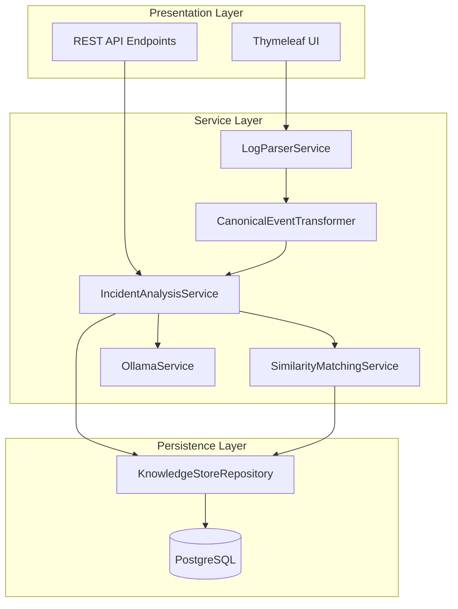
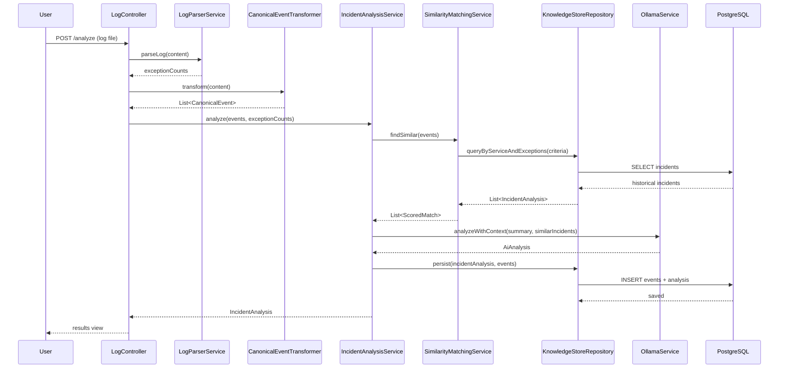
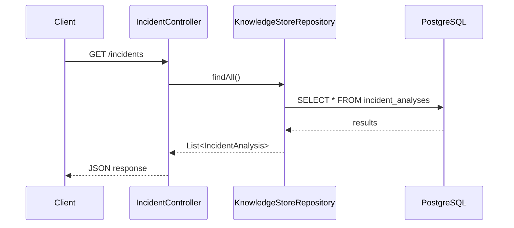
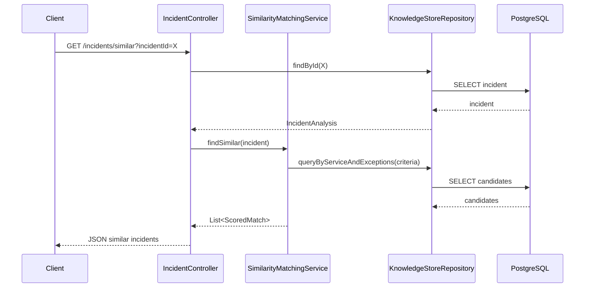

# Design Document: Incident Knowledge Platform

## Overview

This design evolves the existing AI Log Analyzer into an Incident Knowledge Platform. The current system parses log files, counts exceptions, and uses Ollama for AI-powered analysis. The platform introduces persistent storage of analyses as organizational knowledge, enabling historical incident comparison and context-enriched LLM analysis.

Phase 1 introduces a Canonical Event Model for normalized log data, an Incident Analysis Model for structured analysis results, a PostgreSQL-backed Knowledge Store for persistence, and a similarity-matching engine that identifies related historical incidents without vector databases. When generating new analyses, the LLM receives context from similar past incidents, improving root cause identification over time.

The design preserves the existing upload-and-analyze workflow while adding new REST API endpoints for querying historical knowledge. The architecture maintains simplicity: no vector databases, RAG pipelines, LangChain, or multi-agent systems.

## Architecture



## Sequence Diagrams

### Main Flow: Upload and Analyze with Knowledge Context



### Query Flow: Retrieve Historical Incidents



### Similarity Search Flow



## Components and Interfaces

### Component 1: CanonicalEventTransformer

**Purpose**: Transforms raw log text into normalized canonical events with consistent schema.

```java
@Service
public class CanonicalEventTransformer {

    List<CanonicalEvent> transform(String rawLogContent);

    CanonicalEvent parseLine(String logLine);

    String detectService(String logLine);

    String classifyEventType(String logLine, String level);
}
```

**Responsibilities**:
- Parse each log line into a structured CanonicalEvent
- Detect service name from log format (thread name, logger, or configurable default)
- Classify event type: EXCEPTION, ERROR, WARNING, INFO, STACK_TRACE
- Extract and normalize timestamps into ISO-8601 format

### Component 2: IncidentAnalysisService

**Purpose**: Orchestrates the full analysis pipeline: transform events, find similar incidents, call LLM with context, persist results.

```java
@Service
public class IncidentAnalysisService {

    IncidentAnalysis analyze(List<CanonicalEvent> events, Map<String, Integer> exceptionCounts, String modelOverride);

    IncidentAnalysis buildIncidentSummary(List<CanonicalEvent> events, Map<String, Integer> exceptionCounts);

    String buildEnhancedPrompt(String currentSummary, List<ScoredMatch> similarIncidents);

    void persistAnalysis(IncidentAnalysis analysis, List<CanonicalEvent> events);
}
```

**Responsibilities**:
- Coordinate the analysis workflow end-to-end
- Build incident summary from canonical events
- Construct enhanced LLM prompts that include similar historical context
- Persist completed analyses to the Knowledge Store

### Component 3: SimilarityMatchingService

**Purpose**: Finds historically similar incidents using deterministic matching criteria (no vector DB).

```java
@Service
public class SimilarityMatchingService {

    List<ScoredMatch> findSimilar(IncidentAnalysis currentIncident, int maxResults);

    double calculateSimilarityScore(IncidentAnalysis candidate, IncidentAnalysis current);

    double serviceMatchScore(String service1, String service2);

    double exceptionTypeOverlap(Set<String> types1, Set<String> types2);

    double eventCategoryOverlap(Map<String, Integer> dist1, Map<String, Integer> dist2);

    double errorDistributionSimilarity(Map<String, Double> pct1, Map<String, Double> pct2);
}
```

**Responsibilities**:
- Query candidate incidents by service name and exception types
- Score candidates using weighted multi-factor similarity
- Return top-N matches above a minimum threshold
- Avoid comparing an incident with itself

### Component 4: KnowledgeStoreRepository

**Purpose**: Data access layer for PostgreSQL-backed incident knowledge storage.

```java
@Repository
public interface KnowledgeStoreRepository {

    IncidentAnalysis save(IncidentAnalysis analysis);

    void saveEvents(UUID incidentId, List<CanonicalEvent> events);

    Optional<IncidentAnalysis> findById(UUID incidentId);

    List<IncidentAnalysis> findAll(int page, int size);

    List<IncidentAnalysis> findByService(String service);

    List<IncidentAnalysis> findByExceptionTypes(Set<String> exceptionTypes);

    List<IncidentAnalysis> findCandidatesForSimilarity(String service, Set<String> exceptionTypes, UUID excludeId);
}
```

**Responsibilities**:
- CRUD operations for incident analyses
- Bulk insert of canonical events linked to incidents
- Query candidates for similarity matching
- Pagination support for listing endpoints

### Component 5: IncidentController (REST API)

**Purpose**: Exposes REST endpoints for querying historical incident knowledge.

```java
@RestController
@RequestMapping("/incidents")
public class IncidentController {

    @GetMapping
    ResponseEntity<List<IncidentAnalysisSummary>> listIncidents(
        @RequestParam(defaultValue = "0") int page,
        @RequestParam(defaultValue = "20") int size);

    @GetMapping("/{id}")
    ResponseEntity<IncidentAnalysisDetail> getIncident(@PathVariable UUID id);

    @GetMapping("/similar")
    ResponseEntity<List<ScoredMatch>> findSimilar(
        @RequestParam UUID incidentId,
        @RequestParam(defaultValue = "5") int maxResults);
}
```

**Responsibilities**:
- Serve historical incident data as JSON
- Validate request parameters
- Return appropriate HTTP status codes (404 for missing incidents)

## Data Models

### Model 1: CanonicalEvent

```java
public record CanonicalEvent(
    UUID id,
    UUID incidentId,
    Instant timestamp,
    String level,        // ERROR, WARN, INFO, DEBUG
    String service,      // detected or configured service name
    String eventType,    // EXCEPTION, ERROR, WARNING, STACK_TRACE, INFO
    String message       // cleaned log message content
) {}
```

**Validation Rules**:
- `timestamp` must not be null; defaults to parse time if not extractable from log
- `level` must be one of: ERROR, WARN, INFO, DEBUG, TRACE
- `eventType` must be one of: EXCEPTION, ERROR, WARNING, STACK_TRACE, INFO
- `message` must not exceed 4000 characters (truncated if longer)

### Model 2: IncidentAnalysis

```java
public record IncidentAnalysis(
    UUID incidentId,
    Instant analysisDate,
    String service,
    TimeRange timeRange,
    String sourceFilename,
    ErrorSummary errorSummary,
    String rootCause,
    String impact,
    List<String> recommendations,
    AiAnalysis llmAnalysis,
    Map<String, Integer> exceptionCounts,
    Set<String> exceptionTypes,
    Map<String, Double> errorDistribution
) {}

public record TimeRange(Instant start, Instant end) {}

public record ErrorSummary(
    int totalEvents,
    int totalExceptions,
    int uniqueExceptionTypes,
    Map<String, Integer> exceptionCounts
) {}
```

**Validation Rules**:
- `incidentId` auto-generated UUID on creation
- `analysisDate` set to current time on creation
- `timeRange.start` must be before or equal to `timeRange.end`
- `exceptionTypes` derived from exceptionCounts keys
- `errorDistribution` derived from exceptionCounts (percentage per type)

### Model 3: ScoredMatch

```java
public record ScoredMatch(
    UUID incidentId,
    String service,
    Instant analysisDate,
    double similarityScore,    // 0.0 to 1.0
    String rootCause,
    Map<String, String> matchReasons  // factor -> explanation
) {}
```

**Validation Rules**:
- `similarityScore` must be between 0.0 and 1.0 inclusive
- `matchReasons` must contain at least one entry
- Results filtered: only matches with score >= 0.3 are returned

## Database Schema

### Table: incident_analyses

```sql
CREATE TABLE incident_analyses (
    incident_id       UUID PRIMARY KEY DEFAULT gen_random_uuid(),
    analysis_date     TIMESTAMP WITH TIME ZONE NOT NULL DEFAULT NOW(),
    service           VARCHAR(255) NOT NULL,
    source_filename   VARCHAR(500),
    time_range_start  TIMESTAMP WITH TIME ZONE,
    time_range_end    TIMESTAMP WITH TIME ZONE,
    total_events      INTEGER NOT NULL DEFAULT 0,
    total_exceptions  INTEGER NOT NULL DEFAULT 0,
    unique_exception_types INTEGER NOT NULL DEFAULT 0,
    exception_counts  JSONB NOT NULL DEFAULT '{}',
    exception_types   TEXT[] NOT NULL DEFAULT '{}',
    error_distribution JSONB NOT NULL DEFAULT '{}',
    root_cause        TEXT,
    impact            TEXT,
    recommendations   JSONB DEFAULT '[]',
    llm_analysis      JSONB,
    severity          VARCHAR(20),
    confidence        VARCHAR(20)
);

CREATE INDEX idx_analyses_service ON incident_analyses(service);
CREATE INDEX idx_analyses_date ON incident_analyses(analysis_date DESC);
CREATE INDEX idx_analyses_exception_types ON incident_analyses USING GIN(exception_types);
```

### Table: canonical_events

```sql
CREATE TABLE canonical_events (
    id           UUID PRIMARY KEY DEFAULT gen_random_uuid(),
    incident_id  UUID NOT NULL REFERENCES incident_analyses(incident_id) ON DELETE CASCADE,
    timestamp    TIMESTAMP WITH TIME ZONE,
    level        VARCHAR(10) NOT NULL,
    service      VARCHAR(255),
    event_type   VARCHAR(50) NOT NULL,
    message      TEXT
);

CREATE INDEX idx_events_incident ON canonical_events(incident_id);
CREATE INDEX idx_events_type ON canonical_events(event_type);
```

## Key Functions with Formal Specifications

### Function 1: CanonicalEventTransformer.transform()

```java
public List<CanonicalEvent> transform(String rawLogContent) {
    List<CanonicalEvent> events = new ArrayList<>();
    String[] lines = rawLogContent.split("\\r?\\n");
    
    for (String line : lines) {
        if (line.isBlank()) continue;
        CanonicalEvent event = parseLine(line);
        if (event != null) {
            events.add(event);
        }
    }
    return events;
}
```

**Preconditions:**
- `rawLogContent` is non-null and non-empty
- Content is UTF-8 encoded text with newline-separated log entries

**Postconditions:**
- Returns a non-null list (may be empty if no parseable lines)
- Each event in the list has a valid level and eventType
- Events maintain the order they appeared in the input
- No event has a null timestamp (falls back to current time)

**Loop Invariants:**
- All previously processed lines have been either added as events or skipped
- Event count <= total non-blank line count

### Function 2: SimilarityMatchingService.calculateSimilarityScore()

```java
public double calculateSimilarityScore(IncidentAnalysis candidate, IncidentAnalysis current) {
    double score = 0.0;
    
    // Weight factors
    double serviceWeight = 0.30;
    double exceptionTypeWeight = 0.35;
    double eventCategoryWeight = 0.15;
    double errorDistributionWeight = 0.20;
    
    score += serviceWeight * serviceMatchScore(candidate.service(), current.service());
    score += exceptionTypeWeight * exceptionTypeOverlap(candidate.exceptionTypes(), current.exceptionTypes());
    score += eventCategoryWeight * eventCategoryOverlap(candidate.exceptionCounts(), current.exceptionCounts());
    score += errorDistributionWeight * errorDistributionSimilarity(candidate.errorDistribution(), current.errorDistribution());
    
    return Math.min(1.0, Math.max(0.0, score));
}
```

**Preconditions:**
- `candidate` and `current` are non-null with populated exception data
- `candidate.incidentId() != current.incidentId()` (never self-compare)
- Weight factors sum to 1.0

**Postconditions:**
- Returns a value in range [0.0, 1.0]
- Score of 1.0 means identical incident profile
- Score of 0.0 means no similarity on any factor
- Each factor contributes proportionally to its weight

**Loop Invariants:** N/A (no loops)

### Function 3: SimilarityMatchingService.exceptionTypeOverlap()

```java
public double exceptionTypeOverlap(Set<String> types1, Set<String> types2) {
    if (types1.isEmpty() && types2.isEmpty()) return 1.0;
    if (types1.isEmpty() || types2.isEmpty()) return 0.0;
    
    Set<String> intersection = new HashSet<>(types1);
    intersection.retainAll(types2);
    
    Set<String> union = new HashSet<>(types1);
    union.addAll(types2);
    
    return (double) intersection.size() / union.size(); // Jaccard index
}
```

**Preconditions:**
- `types1` and `types2` are non-null (may be empty)

**Postconditions:**
- Returns Jaccard index: |intersection| / |union|
- Returns 1.0 if both sets are empty (both have no exceptions = similar)
- Returns 0.0 if one set is empty and the other is not
- Returns value in range [0.0, 1.0]

**Loop Invariants:** N/A (set operations)

### Function 4: SimilarityMatchingService.errorDistributionSimilarity()

```java
public double errorDistributionSimilarity(Map<String, Double> pct1, Map<String, Double> pct2) {
    if (pct1.isEmpty() && pct2.isEmpty()) return 1.0;
    if (pct1.isEmpty() || pct2.isEmpty()) return 0.0;
    
    // Cosine similarity over error distribution vectors
    Set<String> allKeys = new HashSet<>();
    allKeys.addAll(pct1.keySet());
    allKeys.addAll(pct2.keySet());
    
    double dotProduct = 0.0;
    double norm1 = 0.0;
    double norm2 = 0.0;
    
    for (String key : allKeys) {
        double v1 = pct1.getOrDefault(key, 0.0);
        double v2 = pct2.getOrDefault(key, 0.0);
        dotProduct += v1 * v2;
        norm1 += v1 * v1;
        norm2 += v2 * v2;
    }
    
    if (norm1 == 0.0 || norm2 == 0.0) return 0.0;
    return dotProduct / (Math.sqrt(norm1) * Math.sqrt(norm2));
}
```

**Preconditions:**
- `pct1` and `pct2` are non-null maps of exception type to percentage
- Percentage values are in range [0.0, 100.0]

**Postconditions:**
- Returns cosine similarity in range [0.0, 1.0]
- Returns 1.0 for identical distributions
- Returns 0.0 for completely disjoint distributions or empty inputs
- Order of parameters does not affect result (symmetric)

**Loop Invariants:**
- `dotProduct` = sum of (v1_i * v2_i) for all processed keys
- `norm1` = sum of (v1_i^2) for all processed keys
- `norm2` = sum of (v2_i^2) for all processed keys

### Function 5: IncidentAnalysisService.buildEnhancedPrompt()

```java
public String buildEnhancedPrompt(String currentSummary, List<ScoredMatch> similarIncidents) {
    StringBuilder prompt = new StringBuilder();
    prompt.append(BASE_PROMPT_TEMPLATE.formatted(currentSummary));
    
    if (!similarIncidents.isEmpty()) {
        prompt.append("\n\n--- HISTORICAL CONTEXT ---\n");
        prompt.append("Similar incidents found in our knowledge base:\n\n");
        
        for (int i = 0; i < similarIncidents.size(); i++) {
            ScoredMatch match = similarIncidents.get(i);
            prompt.append("Incident %d (%.0f%% similar):\n".formatted(i + 1, match.similarityScore() * 100));
            prompt.append("  Service: %s\n".formatted(match.service()));
            prompt.append("  Root Cause: %s\n".formatted(match.rootCause()));
            prompt.append("  Match Factors: %s\n\n".formatted(match.matchReasons()));
        }
        
        prompt.append("Consider these historical incidents when determining root cause. ");
        prompt.append("Note similarities and differences from past occurrences.\n");
    }
    
    return prompt.toString();
}
```

**Preconditions:**
- `currentSummary` is non-null, non-empty JSON string
- `similarIncidents` is non-null (may be empty)
- Each ScoredMatch has non-null rootCause and service

**Postconditions:**
- Returns valid prompt string containing the current summary
- If similarIncidents is empty, returns base prompt without historical context
- If similarIncidents is non-empty, appends numbered historical context
- Prompt length does not exceed model context window (truncation at 8000 chars for history section)

**Loop Invariants:**
- All processed similar incidents (0..i-1) are appended to prompt
- Prompt grows monotonically

## Algorithmic Pseudocode

### Main Analysis Pipeline Algorithm

```java
// Algorithm: Full Incident Analysis Pipeline
// INPUT: rawLogContent (String), modelOverride (String, nullable)
// OUTPUT: IncidentAnalysis (persisted and returned)

public IncidentAnalysis analyzeAndPersist(String rawLogContent, String sourceFilename, String modelOverride) {
    // Step 1: Parse exceptions (existing behavior)
    Map<String, Integer> exceptionCounts = logParserService.parseLog(rawLogContent);
    
    // Step 2: Transform to canonical events
    List<CanonicalEvent> events = canonicalEventTransformer.transform(rawLogContent);
    
    // Step 3: Build incident summary
    IncidentAnalysis incidentDraft = buildIncidentSummary(events, exceptionCounts, sourceFilename);
    
    // Step 4: Find similar historical incidents
    List<ScoredMatch> similarIncidents = similarityMatchingService.findSimilar(incidentDraft, 5);
    
    // Step 5: Build enhanced prompt with historical context
    String enrichedSummary = logParserService.buildEnrichedSummary(rawLogContent);
    String enhancedPrompt = buildEnhancedPrompt(enrichedSummary, similarIncidents);
    
    // Step 6: Call LLM with enhanced context
    String modelToUse = (modelOverride != null) ? modelOverride : defaultModel;
    AiAnalysis llmResult = ollamaService.getStructuredAnalysis(enhancedPrompt, modelToUse);
    
    // Step 7: Compose final incident analysis
    IncidentAnalysis finalAnalysis = incidentDraft.withLlmAnalysis(llmResult)
        .withRootCause(llmResult.getRootCause())
        .withImpact(extractImpact(llmResult))
        .withRecommendations(extractRecommendations(llmResult));
    
    // Step 8: Persist to knowledge store
    knowledgeStoreRepository.save(finalAnalysis);
    knowledgeStoreRepository.saveEvents(finalAnalysis.incidentId(), events);
    
    return finalAnalysis;
}
```

### Similarity Search Algorithm

```java
// Algorithm: Find Similar Incidents
// INPUT: currentIncident (IncidentAnalysis), maxResults (int)
// OUTPUT: List<ScoredMatch> sorted by score descending, size <= maxResults

public List<ScoredMatch> findSimilar(IncidentAnalysis currentIncident, int maxResults) {
    double MINIMUM_THRESHOLD = 0.3;
    
    // Step 1: Query candidates from DB (pre-filter by service OR exception types)
    List<IncidentAnalysis> candidates = knowledgeStoreRepository
        .findCandidatesForSimilarity(
            currentIncident.service(),
            currentIncident.exceptionTypes(),
            currentIncident.incidentId()  // exclude self
        );
    
    // Step 2: Score each candidate
    List<ScoredMatch> scored = new ArrayList<>();
    for (IncidentAnalysis candidate : candidates) {
        double score = calculateSimilarityScore(candidate, currentIncident);
        
        if (score >= MINIMUM_THRESHOLD) {
            Map<String, String> reasons = buildMatchReasons(candidate, currentIncident);
            scored.add(new ScoredMatch(
                candidate.incidentId(),
                candidate.service(),
                candidate.analysisDate(),
                score,
                candidate.rootCause(),
                reasons
            ));
        }
    }
    
    // Step 3: Sort by score descending, take top N
    scored.sort(Comparator.comparingDouble(ScoredMatch::similarityScore).reversed());
    return scored.stream().limit(maxResults).toList();
}
```

### Candidate Query Algorithm (SQL-level pre-filtering)

```java
// Algorithm: Find Candidate Incidents for Similarity
// Uses PostgreSQL array overlap and service matching for pre-filtering
// INPUT: service (String), exceptionTypes (Set<String>), excludeId (UUID)
// OUTPUT: List<IncidentAnalysis> candidates (broader set for scoring)

public List<IncidentAnalysis> findCandidatesForSimilarity(
        String service, Set<String> exceptionTypes, UUID excludeId) {
    
    // SQL: SELECT * FROM incident_analyses
    //      WHERE incident_id != :excludeId
    //        AND (service = :service OR exception_types && :exceptionTypesArray)
    //      ORDER BY analysis_date DESC
    //      LIMIT 50
    
    // The && operator checks PostgreSQL array overlap
    // This returns incidents that share EITHER the same service OR any exception type
    // Scoring will differentiate quality of match
}
```

## Example Usage

```java
// Example 1: Analyze a log file (controller integration)
@PostMapping("/analyze")
public String analyze(@RequestParam("file") MultipartFile file, Model model) {
    String content = new String(file.getBytes(), StandardCharsets.UTF_8);
    
    IncidentAnalysis analysis = incidentAnalysisService
        .analyzeAndPersist(content, file.getOriginalFilename(), selectedModel);
    
    model.addAttribute("analysis", analysis);
    model.addAttribute("aiAnalysis", analysis.llmAnalysis());
    return "results";
}

// Example 2: Query historical incidents (REST API)
@GetMapping("/incidents")
public ResponseEntity<List<IncidentAnalysisSummary>> listIncidents(
        @RequestParam(defaultValue = "0") int page,
        @RequestParam(defaultValue = "20") int size) {
    
    List<IncidentAnalysis> incidents = knowledgeStoreRepository.findAll(page, size);
    List<IncidentAnalysisSummary> summaries = incidents.stream()
        .map(IncidentAnalysisSummary::from)
        .toList();
    return ResponseEntity.ok(summaries);
}

// Example 3: Find similar incidents
@GetMapping("/incidents/similar")
public ResponseEntity<List<ScoredMatch>> findSimilar(
        @RequestParam UUID incidentId,
        @RequestParam(defaultValue = "5") int maxResults) {
    
    IncidentAnalysis incident = knowledgeStoreRepository.findById(incidentId)
        .orElseThrow(() -> new ResponseStatusException(HttpStatus.NOT_FOUND));
    
    List<ScoredMatch> similar = similarityMatchingService.findSimilar(incident, maxResults);
    return ResponseEntity.ok(similar);
}

// Example 4: Similarity scoring in action
IncidentAnalysis current = new IncidentAnalysis(
    UUID.randomUUID(), Instant.now(), "payment-service", ...
    Set.of("SQLTransientConnectionException", "TimeoutException"), ...
);

IncidentAnalysis historical = new IncidentAnalysis(
    UUID.randomUUID(), pastDate, "payment-service", ...
    Set.of("SQLTransientConnectionException", "ConnectionPoolExhaustedException"), ...
);

double score = similarityMatchingService.calculateSimilarityScore(historical, current);
// score ≈ 0.65 (same service + overlapping exception types + similar distribution)
```

## Correctness Properties

*A property is a characteristic or behavior that should hold true across all valid executions of a system—essentially, a formal statement about what the system should do. Properties serve as the bridge between human-readable specifications and machine-verifiable correctness guarantees.*

### Property 1: Canonical Event Field Validity

*For any* raw log content, every CanonicalEvent produced by the transformer SHALL have a level from the set {ERROR, WARN, INFO, DEBUG, TRACE} and an eventType from the set {EXCEPTION, ERROR, WARNING, STACK_TRACE, INFO}.

**Validates: Requirements 1.4, 1.5, 8.1, 8.2**

### Property 2: Event Ordering Preservation

*For any* multi-line log content, the list of CanonicalEvents produced by the transformer SHALL maintain the same relative order as the non-blank lines in the input.

**Validates: Requirement 1.7**

### Property 3: Message Truncation Invariant

*For any* log line, the resulting CanonicalEvent message SHALL have length at most 4000 characters.

**Validates: Requirement 1.6**

### Property 4: Similarity Score Boundedness

*For any* two IncidentAnalysis objects, `calculateSimilarityScore(A, B)` SHALL return a value in the range [0.0, 1.0].

**Validates: Requirements 3.2, 8.3**

### Property 5: Similarity Symmetry

*For any* two IncidentAnalysis objects A and B, `calculateSimilarityScore(A, B)` SHALL equal `calculateSimilarityScore(B, A)`.

**Validates: Requirement 3.3**

### Property 6: Self-Exclusion from Similarity Results

*For any* incident queried for similar incidents, the returned list of ScoredMatch results SHALL NOT contain the queried incident's own ID.

**Validates: Requirement 3.4**

### Property 7: Jaccard Index Correctness

*For any* two sets of exception types, `exceptionTypeOverlap(S1, S2)` SHALL equal |S1 ∩ S2| / |S1 ∪ S2|, returning 1.0 when both sets are empty and 0.0 when exactly one set is empty.

**Validates: Requirements 3.5, 3.6, 3.7**

### Property 8: Cosine Similarity Correctness

*For any* two error distribution maps with non-negative values, `errorDistributionSimilarity(D1, D2)` SHALL return a value equal to the cosine similarity formula (dot product / product of norms), bounded in [0.0, 1.0].

**Validates: Requirement 3.8**

### Property 9: Threshold Filtering

*For any* similarity query result, every ScoredMatch in the returned list SHALL have a similarityScore >= 0.3.

**Validates: Requirement 3.9**

### Property 10: Result Ordering Guarantee

*For any* similarity query result containing multiple matches, the list SHALL be sorted by similarityScore in descending order (each element's score >= the next element's score).

**Validates: Requirement 3.10**

### Property 11: Error Distribution Sum Invariant

*For any* IncidentAnalysis with non-empty exceptionCounts, the values in errorDistribution SHALL sum to approximately 100.0 (±0.1 tolerance for floating point).

**Validates: Requirements 2.4, 8.6**

### Property 12: ExceptionTypes Derivation Consistency

*For any* IncidentAnalysis, the exceptionTypes set SHALL equal the key set of exceptionCounts.

**Validates: Requirements 2.5, 8.7**

### Property 13: Idempotent but Distinct Persistence

*For any* log content analyzed N times, the system SHALL produce N distinct IncidentAnalysis records each with a unique incidentId.

**Validates: Requirement 2.6**

### Property 14: Historical Context Conditionality

*For any* analysis where similar incidents with score >= 0.3 exist, the enhanced prompt SHALL contain historical context. *For any* analysis where no similar incidents exist, the prompt SHALL be identical to the base prompt.

**Validates: Requirements 5.1, 5.2**

### Property 15: Prompt Historical Context Size Cap

*For any* enhanced prompt built with similar incidents, the historical context section SHALL not exceed 8000 characters.

**Validates: Requirement 5.3**

### Property 16: Persistence Round-Trip

*For any* valid IncidentAnalysis object, saving it to the KnowledgeStore and then retrieving it by ID SHALL produce an object with equivalent field values.

**Validates: Requirement 4.1**

### Property 17: Pagination Bound

*For any* GET /incidents request with page size parameter S, the returned list SHALL contain at most S elements.

**Validates: Requirements 6.1, 6.6**

### Property 18: TimeRange Validity

*For any* IncidentAnalysis, the timeRange start SHALL be before or equal to timeRange end.

**Validates: Requirement 8.4**

### Property 19: MatchReasons Non-Empty

*For any* ScoredMatch returned by the similarity service, the matchReasons map SHALL contain at least one entry.

**Validates: Requirement 8.5**

### Property 20: Timestamp Extraction Round-Trip

*For any* log line containing a timestamp in a supported format, the CanonicalEventTransformer SHALL extract and normalize it to a valid ISO-8601 timestamp that represents the same point in time.

**Validates: Requirement 1.2**

## Error Handling

### Error Scenario 1: PostgreSQL Unavailable

**Condition**: Database connection fails during persist or query operations
**Response**: Analysis still completes using LLM (graceful degradation). Persistence failure is logged as ERROR. The API returns the analysis result without historical context.
**Recovery**: Spring retry with exponential backoff (3 attempts). If all fail, mark analysis as `persisted=false` and return result to user with a warning.

### Error Scenario 2: No Historical Data (Cold Start)

**Condition**: Knowledge store is empty; similarity search returns no candidates
**Response**: Analysis proceeds with base prompt (no historical context section). Functionally identical to current behavior.
**Recovery**: N/A — system builds knowledge over time. Each analysis enriches the store.

### Error Scenario 3: LLM Timeout or Failure

**Condition**: Ollama does not respond within configured timeout
**Response**: Return partial IncidentAnalysis with null llmAnalysis. Persist the incident with events and error summary but without AI-generated root cause.
**Recovery**: User can re-trigger analysis later via `POST /incidents/{id}/reanalyze` (future enhancement).

### Error Scenario 4: Malformed Log Content

**Condition**: Uploaded file contains no parseable log lines (no timestamps, no recognizable patterns)
**Response**: CanonicalEventTransformer returns empty list. Controller returns error message to user: "No parseable log entries found."
**Recovery**: User uploads a different file. No data persisted for failed attempts.

### Error Scenario 5: Large Log File (Memory Pressure)

**Condition**: Log file exceeds practical processing limits (>100MB)
**Response**: Process in streaming fashion — parse and transform line-by-line without loading full content into memory for event transformation.
**Recovery**: Current `spring.servlet.multipart.max-file-size=1GB` setting allows large files. Event batch insertion (1000 per batch) prevents OOM during persistence.

## Testing Strategy

### Unit Testing Approach

- **CanonicalEventTransformer**: Test with various log formats (Spring Boot default, custom patterns, multiline stack traces). Verify correct level/eventType/timestamp extraction.
- **SimilarityMatchingService**: Test score calculation with known inputs. Verify Jaccard index and cosine similarity math. Test edge cases (empty sets, identical incidents, completely different incidents).
- **IncidentAnalysisService**: Mock repository and Ollama. Verify pipeline orchestration, prompt construction, and persistence calls.

### Property-Based Testing Approach

**Property Test Library**: jqwik (JUnit 5 property-based testing for Java)

- **Similarity score is always bounded**: For any two randomly generated IncidentAnalysis objects, score ∈ [0.0, 1.0]
- **Similarity is symmetric**: score(A, B) == score(B, A) for arbitrary A, B
- **Jaccard index properties**: For any two sets, 0 ≤ |A∩B|/|A∪B| ≤ 1, and equals 1.0 iff A == B
- **Cosine similarity properties**: For any two non-negative vectors, result ∈ [0.0, 1.0]
- **Event transformation is total**: For any non-blank string input, transformation produces at least one event

### Integration Testing Approach

- **PostgreSQL integration**: Use Testcontainers to verify schema creation, CRUD operations, and similarity queries with GIN indexes.
- **Full pipeline test**: Upload sample log → verify events persisted → verify analysis persisted → query similar → verify response structure.
- **LLM integration**: Test with WireMock stubbing Ollama API responses to verify prompt construction and response parsing.

## Performance Considerations

- **Similarity query optimization**: PostgreSQL GIN index on `exception_types` array enables fast overlap queries. Pre-filtering by service reduces candidate set before scoring.
- **Batch event insertion**: Insert canonical events in batches of 1000 using `JdbcTemplate.batchUpdate()` rather than individual inserts.
- **Candidate limit**: Similarity pre-filter query limited to 50 most recent candidates to bound scoring time.
- **Connection pooling**: HikariCP (Spring Boot default) with pool size tuned for concurrent analysis requests.
- **Prompt size management**: Historical context section in LLM prompt capped at 8000 characters to stay within model context window.

## Security Considerations

- **SQL Injection Prevention**: All database queries use parameterized statements via Spring Data JPA / JdbcTemplate named parameters.
- **Input Validation**: Log file content is treated as untrusted input. No log content is executed or evaluated. Event messages are stored as plain text.
- **API Rate Limiting**: Consider adding rate limiting to `/incidents/similar` endpoint to prevent abuse of similarity computation.
- **Data Retention**: No PII expected in log files, but consider configurable retention period for stored events and analyses.

## Dependencies

### New Dependencies (to add to pom.xml)

| Dependency | Purpose |
|-----------|---------|
| `spring-boot-starter-data-jpa` | JPA + Hibernate for PostgreSQL access |
| `postgresql` (runtime) | PostgreSQL JDBC driver |
| `spring-boot-starter-validation` | Bean validation for request parameters |
| `flyway-core` | Database schema migration management |
| `jqwik` (test) | Property-based testing |
| `testcontainers` (test) | PostgreSQL integration tests |

### Existing Dependencies (unchanged)

| Dependency | Purpose |
|-----------|---------|
| `spring-boot-starter-web` | REST controllers + Thymeleaf |
| `spring-boot-starter-thymeleaf` | Template rendering |
| `spring-boot-starter-webflux` | WebClient for Ollama API |
